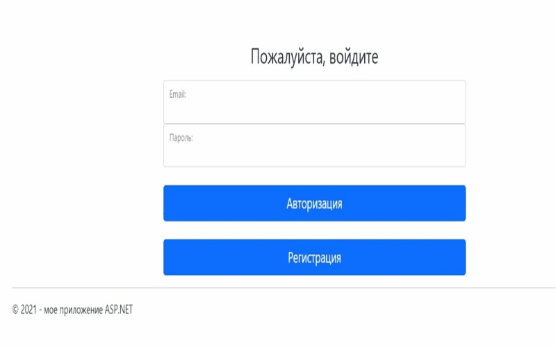

# Учет компьютерного оборудования

*Учет компьютерной техники* — это процесс ведения бухгалтерского учета компьютеров и связанного с ними оборудования в организации.

### Содержание
- [Назначение](#why)
- [Установка](#install)
- [Применение](#apply)
- [Лицензия](#license)

#### Назначение:

Разработанный программный выполняет следующие функции:
‒	добавление, изменение и удаление данных в базе данных;
‒	сортировка и фильтрация данных;
‒	формирование отчётов и вывод данных в MS Word, MS Excel;
‒	формирование диаграмм.

#### Установка:

Веб-сайт должен быть развёрнут в сети Интернет или локальной сети организации.
Требования к  программному обеспечению:
1. пакет Microsoft NET-SDK 8.0;
2. веб-сервер Nginx (Apache, IIS);
3. Операционная система Windows 7 и выше;
4. СУБД «MySQL» 6.0 и выше.

Для корректной работы необходимо указать корректную строку подключения для работы с базой данных MySql `ComputerAccounting/Web.config`.

Технологии и компоненты: Asp.Net MVC, Entity Framework, C#, Bootstrap, HTML5, CSS3, JavaScript, ClosedXML, Google.Protobuf, Office.Interop.Word.

#### Применение:

Разработанный проект позволил:
+	повысить эффективность работы предприятия;
+	автоматизировать процесс ведения учета компьютерного оборудования;
+	автоматизировать процесс оформления отчётов в MS Word, MS Excel;
+	повысить степень технологичности выполняемых процессов и качество контроля за специалистами.

#### Лицензия:

> GitHub [@TheLidren](https://github.com/TheLidren)
LinkedIn [@Vladislav Misevich](https://by.linkedin.com/in/thelidren/ru)

